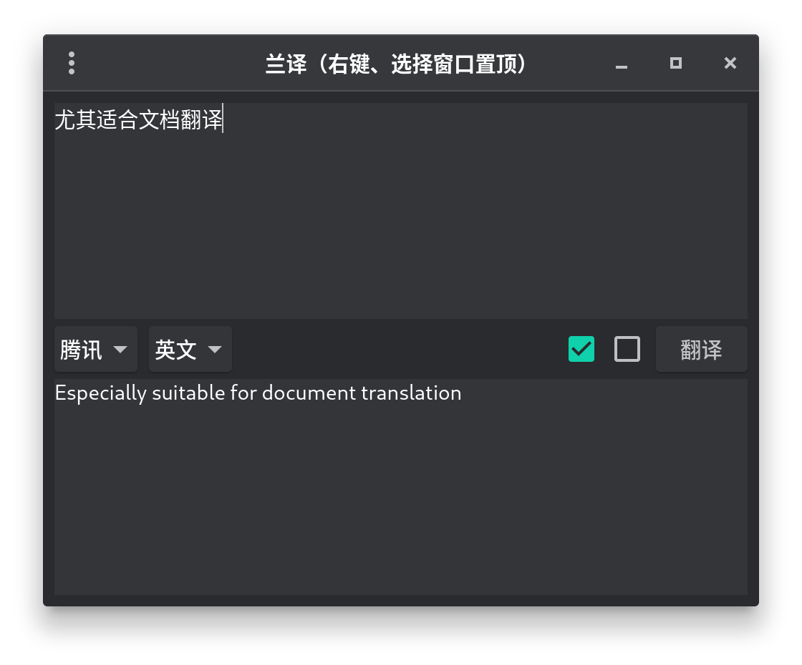
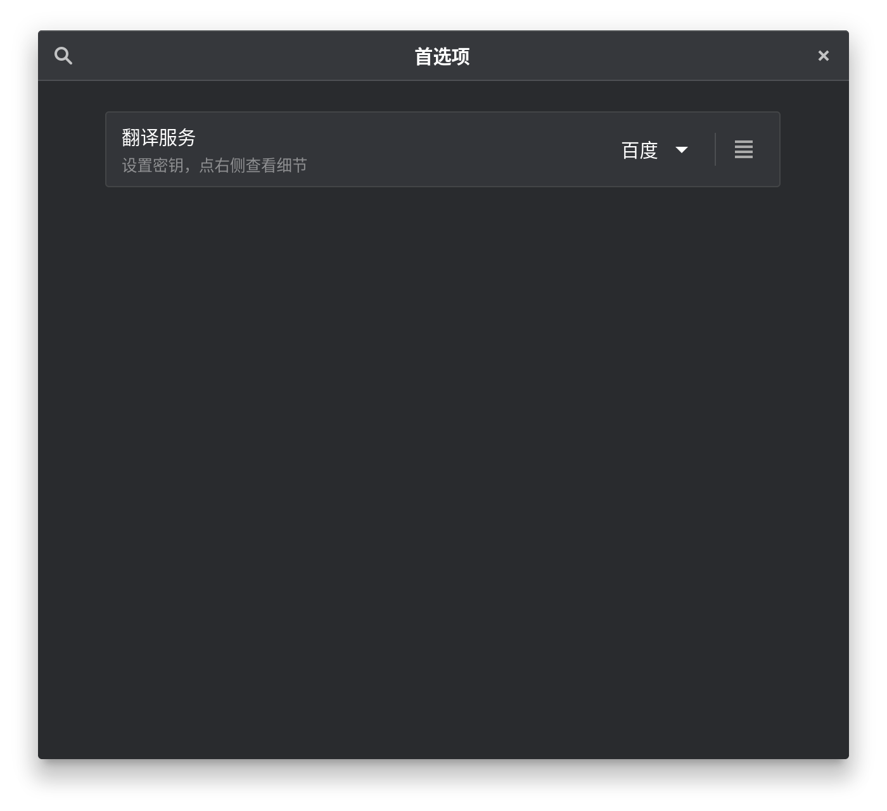
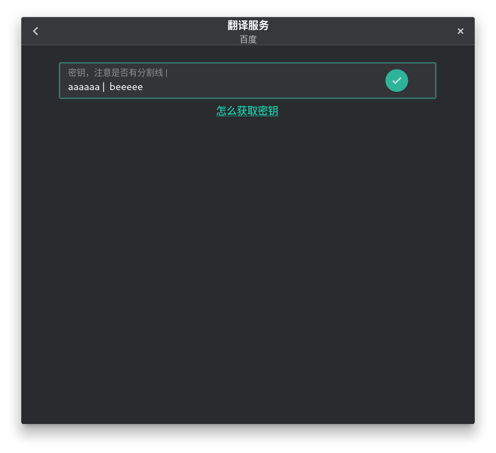

# 兰译 lfy 

优势：

- [x] 复制，自动翻译并弹窗
- [x] 支持 `gnome` 原生 `libadwaita`，简洁、美观！
- [x] 提供多种打包格式，预计推出 `archlinux` `deb` 等
- [x] 多引擎支持，目前 `百度、腾讯、谷歌、有道`，未来预计更多
- [x] 界面支持多国语言，使用 `gettext`

> 我英语不好，所以开发此项目。软件界面默认英文，有中文翻译，但是文档字太多，我只写中文……，其他人可以翻译文档，包括代码中的注释，也可以翻译

- [贡献说明](doc/CONTRIBUTE.md)

- [翻译说明](doc/TRANSLATE.md)

- [更新说明](doc/CONTRIBUTE.md)

部分代码参考：

- [gnome-music](https://gitlab.gnome.org/GNOME/gnome-music)
- [dialect](https://github.com/dialect-app/dialect)
